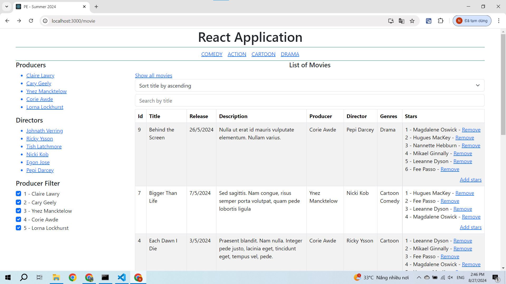

# Student Management

## Visual interface



## Installation

1. **Clone the Repository**

   ```bash
   git clone https://github.com/nguyendien9203/PE_BLOCK5_SU24.git
   ```

2. **Install Dependencies**

    ```bash
    npm install
    ```
    
3. **Start the Development Server**
    ### Start the Json Server

    ```bash
    json-server --watch database.json --port 9999
    ```

    ### Start the React development server with:

    ```bash
    npm start
    ```
